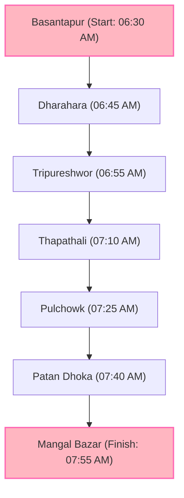

# PROPOSAL FOR ROAD PERMIT & SECURITY DOCKET: PINKWALK 2026

---

**DOCUMENT IDENTIFICATION:**
*   **Event Name:** PinkWalk 2026 (Breast Cancer Awareness Walk)
*   **Organizing Body:** Infinite Care, Kathmandu
*   **Event Date:** Saturday, October 3rd, 2026 (Ashoj 17, 2083)
*   **Route:** Basantapur (Kathmandu Durbar Square) to Mangal Bazar (Lalitpur Durbar Square)
*   **Estimated Turnout:** 1,000 to 1,500+ participants
*   **Submitted To:** District Administration Office (Kathmandu/Lalitpur), Traffic Police Division, Kathmandu & Lalitpur Metropolitan Cities

---

## 1. OFFICIAL COVER LETTER (SAMPLE TEMPLATE)

**Date:** September 3rd, 2026

**To,**
The Chief District Officer / Chief of Traffic Police,
District Administration Office / Metropolitan Traffic Police Division,
Kathmandu / Lalitpur, Nepal.

**Subject: Request for Route Clearance, Security Coordination, and Permission for PinkWalk 2026**

Respected Sir/Madam,

We write to you on behalf of **Infinite Care**, a community-oriented healthcare support organization, to request official permission, route clearance, and security/traffic coordination for the upcoming **PinkWalk 2026**. 

PinkWalk is a peaceful, community-led breast cancer awareness and solidarity walk organized annually during Breast Cancer Awareness Month (October). This year marks our major valley walk on **Saturday, October 3rd, 2026**, starting from **Basantapur (Kathmandu Durbar Square)** and concluding at **Mangal Bazar (Lalitpur Durbar Square)**.

Our objective is to spread crucial awareness about early detection of breast cancer, demonstrate support for cancer survivors, and advocate for health screenings. We are partnering with premier medical institutions (such as the *National Hospital & Cancer Research Center*), corporate sponsors, and civic volunteers to ensure a safe, peaceful, and highly structured assembly.

Given that the walk traverses through segments of Kathmandu and Lalitpur, we kindly request:
1. Formal route permission for the group from 6:30 AM to 8:30 AM.
2. Traffic coordination at key intersections (Tripureshwor, Thapathali, Pulchowk, Patan Dhoka).
3. Mobilization of local safety/security presence to guide participants along the pedestrian paths.
4. Permission to conduct a brief assembly and opening session (including a small temporary stage) at Basantapur Durbar Square.
5. Permission to use the designated parking area at Dharahara for event-related vehicles and participants.
6. Support for the symbolic pink illumination of Gaddi Baithak (Basantapur) and Dharahara from October 1 to October 3, 2026.

We have enclosed the detailed event layout, timeline, medical deployment plans, and safety protocols for your review. We are fully committed to adhering to all instructions provided by your administration.

Thank you for your leadership and support towards community health awareness.

Yours sincerely,

_________________________
**Dijup Tuladhar / Lijala Shrestha**
Event Coordinators, PinkWalk 2026
Infinite Care, Kathmandu
Email: pinkwalknepal@gmail.com

---

## 2. EXECUTIVE SUMMARY

| Detail | Specifications |
| :--- | :--- |
| **Organizer** | Infinite Care |
| **Event Date** | Saturday, October 3rd, 2026 (Ashoj 17, 2083) |
| **Reporting Time** | 6:00 AM (Assembly at Basantapur) |
| **Start Time** | 6:30 AM |
| **Estimated Duration** | 1 Hour 15 Minutes (Walking pace) |
| **Start Point** | Basantapur (Kathmandu Durbar Square) |
| **End Point** | Mangal Bazar (Lalitpur Durbar Square) |
| **Total Distance** | ≈ 4.3 Kilometers |
| **Chief Collaborator** | National Hospital & Cancer Research Center (Medical Support) |
| **Sponsors & Partners** | ISS Pvt. Ltd., Pathao Nepal, Dabur Real, H2O Drinking Water, Jeevee Health |

---

## 3. OBJECTIVES OF THE WALK

Breast cancer remains one of the most diagnosed cancers among women in Nepal. Lack of awareness leads to delayed diagnoses, which limits treatment success. PinkWalk 2026 aims to tackle this by:
*   **Promoting Early Detection:** Distributing educational pamphlets detailing breast self-examinations (BSE) and clinic screenings.
*   **Fostering Solidarity:** Providing a platform for survivors, families, medical practitioners, and community members to walk in unity.
*   **Raising Support Funds:** Working alongside partners to support breast cancer patients facing severe financial hardship in accessing chemotherapy and radiotherapy.

---

## 4. DETAILED ROUTE MAP & INTERSECTION TIMINGS

The proposed route is designed to maximize visibility on major roads while using wide pavements, minimizing disruption to early-morning public transit.

### Route Stops & Estimated Progression:
1.  **Assembly & Briefing:** Basantapur Durbar Square (06:00 AM - 06:30 AM)
2.  **Stop 1: Dharahara** (06:45 AM) - Walking south towards Sundhara.
3.  **Stop 2: Tripureshwor** (06:55 AM) - Turning east towards the Thapathali Bridge.
4.  **Stop 3: Thapathali** (07:10 AM) - Crossing Bagmati Bridge into Lalitpur jurisdiction.
5.  **Stop 4: Pulchowk** (07:25 AM) - Ascending towards the Pulchowk intersection.
6.  **Stop 5: Patan Dhoka** (07:40 AM) - Entering the historic core of Lalitpur.
7.  **Final Assembly: Mangalbazar** (07:55 AM) - Short closing remarks, distribution of refreshments, and medical info-desks.

---

## 5. TRAFFIC & CROWD MANAGEMENT PROTOCOLS

To ensure the safety of participants and the general public, Infinite Care will deploy the following logistics:

### A. Volunteer Deployment
*   **Route Marshals:** 80+ trained volunteers wearing highly visible pink custom T-shirts and reflective bands.
*   **Pavement Discipline:** Volunteers will form a human chain along the edge of the road to keep participants strictly on sidewalks/left-side lanes.
*   **Intersection Guides:** Teams of 4 volunteers will assist traffic police at major roundabouts to ensure safe crossing without stalling regular vehicles.

### B. Traffic Flow Preservation
*   The walk is scheduled for **Saturday morning**, which has the lowest traffic density of the week.
*   No road blockages will be implemented. The walk will move as a continuous, orderly column.

---

## 6. MEDICAL AND SAFETY PLAN

We hold safety as our highest priority. The following measures will be active during the walk:

*   **Lead Ambulance:** Provided by the *National Hospital & Cancer Research Center*, following the column with a doctor and emergency medical technicians (EMTs).
*   **First Aid Stations:** Stationary first-aid volunteers deployed at **Thapathali (Bagmati Bridge)** and the **Pulchowk** climb.
*   **Hydration Points:** Managed by *H2O Drinking Water* and *Dabur Real* at the start, mid-way (Thapathali), and finish line (Mangalbazar) to prevent dehydration.
*   **Emergency Contact:** Unified communication channels between lead organizers, marshals, and local traffic desks.

---

## 7. PARTNERS, ENDORSERS, AND SPONSORS

A distinguished group of organizations is backing this community health initiative:

*   **Clinical Partner:** *National Hospital & Cancer Research Center* (facilitating awareness booklets, doctors on-site).
*   **Logistics & Corporate Partners:** *ISS Pvt. Ltd.*, *Pathao Nepal* (assisting with riders/marshals coordination).
*   **Beverage and Nutrition Partners:** *Dabur Real* and *H2O Drinking Water*.
*   **Digital Health Partner:** *Jeevee Health Pvt. Ltd.*
*   **Prominent Endorsers:** High-profile community leaders, cancer survivors, and public personalities including members of *Miss Universe Nepal* and the *Nepal Cancer Survivor's Society*.

---

## 8. REQUESTS FOR KATHMANDU METROPOLITAN SUPPORT

As part of the event, we are planning a community walk through some of Kathmandu's prominent landmarks. We would therefore like to request your support and necessary permissions for the following activities:

### 1. Permission to Conduct a Session at Basantapur Durbar Square
We would like to conduct the opening activities of PinkWalk at **Basantapur Durbar Square**. For this purpose, we plan to set up a **small temporary stage** and conduct a brief awareness session for participants before the walk begins.

We will ensure that the setup is temporary, minimal, and conducted in accordance with the applicable guidelines and requirements for the heritage site. We will also take responsibility for maintaining cleanliness.

### 2. Parking Arrangement at Dharahara
As Dharahara will be one of the key points along our walking route, we would also like to request permission to use the **designated parking area at Dharahara** for event-related vehicles and participants, subject to the availability and applicable regulations.

We will ensure that parking is managed responsibly and does not obstruct regular visitors or public movement.

### 3. Pink Lighting at Dharahara and Basantapur
As a symbolic gesture to support breast cancer awareness, we respectfully request permission to **illuminate Dharahara and Gaddi Baithak, Basantapur in pink** from October 1 to October 3, 2026, subject to the applicable regulations and technical requirements of the sites.

Pink is internationally recognized as the color representing breast cancer awareness. Illuminating Dharahara and Gaddi Baithak in pink would serve as a powerful visual reminder of Kathmandu's commitment to supporting those affected by breast cancer. As October is observed globally as Breast Cancer Awareness Month, this initiative would help raise awareness, encourage early detection, and inspire community-wise support for the cause.

